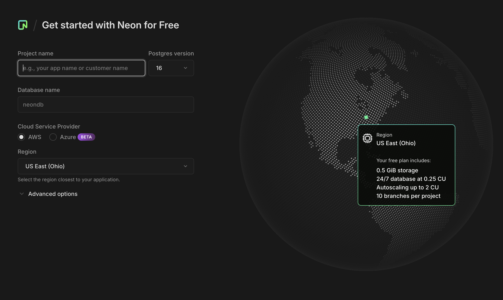
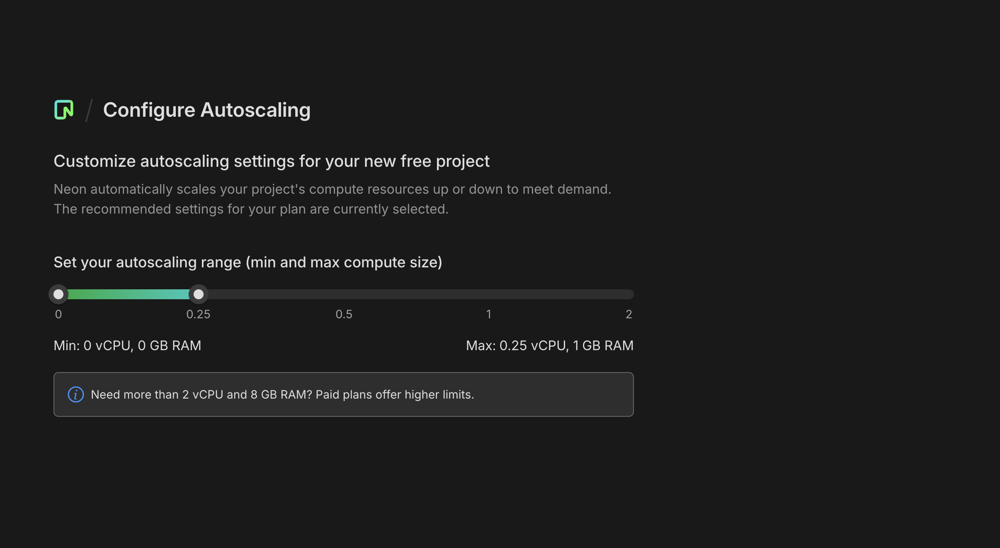
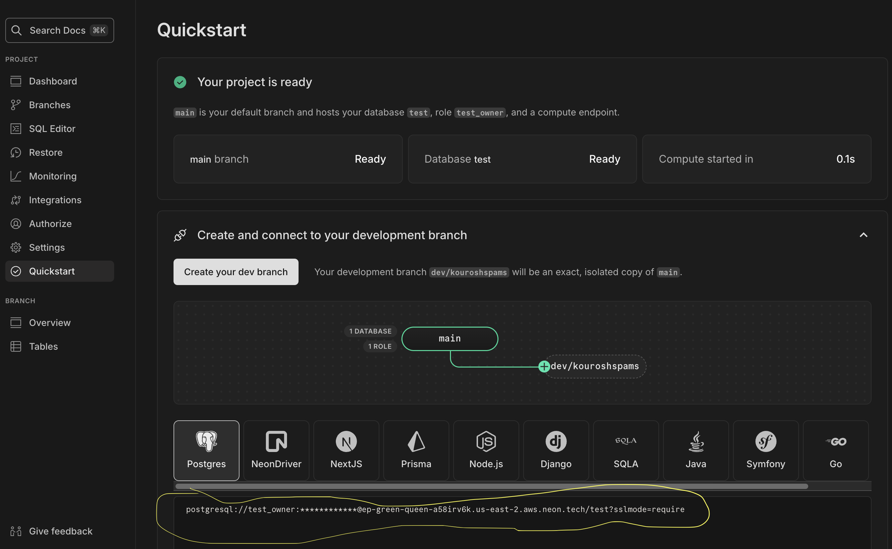

# ORM Demo

ACM CSUF Dev FA24

### Clone Repository

```bash
git clone https://github.com/kourosh-alasti/orm-demo
```

### Visit neon.tech

[https://console.neon.tech/app/projects](https://console.neon.tech/app/projects)

#### What Now?

**Create Project**

<div align="center">

</div>

**Set Compute**

<div>

</div>

**Get Connection String**

<div></div>

#### Set `DATABASE_URL` in `.env`

## Schema Design and Query Building

### Schema Design (for PostgreSQL)

`postTable`: Represents blog posts with the fields `id`, `title`, and `content`

- Each Post has a random generated UUID
- Both `title` and `content` are required fields

`commentTable`: Represents comments associated to a post with fields, `id`, `message`, and `postId`

- `postId` is a foreign key that links each comment to a specific post

#### Push Schema to Database

```bash
npm run db:push
```

### Query Building

#### Inserting Data

```typescript
const newPost = await db
  .insert(postTable)
  .values({
    title: "My First Post",
    content: "Content of First Post",
  })
  .returning();
```

```typescript
const newComment = await db
  .insert(commentTable)
  .values({
    message: "Great post!",
    postId: newPost[0].id,
  })
  .returning();
```

#### Querying Data

```typescript
const allPosts = await db.select().from(postTable);
```

```typescript
const commentsForSpecificPost = await db
  .select()
  .from(commentTable)
  .where(commentTable.postId.eq(newPost[0].id));
```

```typescript
const postAndComments = await db.query.postTable.findMany({
  with: {
    comments: true,
  },
});
```

#### Updating Data

```typescript
const updatedPost = await db
  .update(postTable)
  .set({ title: "Updated Title" })
  .where(postTable.id.eq(newPost[0].id))
  .returning();
```

#### Deleting Data

```typescript
const deletedComment = await db
  .delete(commentTable)
  .where(commentTable.id.eq(newComment[0].id))
  .returning();
```

#### Start Drizzle-Kit Studio to view tables and run queries

```bash
npm run db:studio
```
